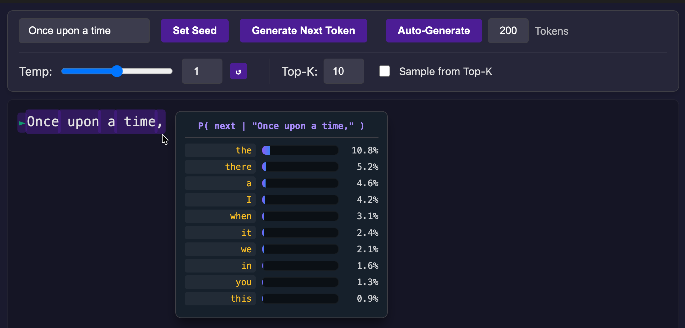

# Torch Crash Course: From Gradients to Next-Token Prediction

This repository contains a concise yet comprehensive introduction to PyTorch, moving from the fundamentals of optimization and gradients to the implementation of autoregressive language models.

## Getting Started

### 1. Install `uv`
Install the `uv` package manager if you haven't already:

**macOS / Linux:**
```bash
curl -LsSf https://astral.sh/uv/install.sh | sh
```

**Windows:**
```powershell
powershell -ExecutionPolicy ByPass -c "irm https://astral.sh/uv/install.ps1 | iex"
```

### 2. Set up the environment
Create the virtual environment and install all dependencies:
```bash
uv sync
```

### 3. Usage
#### Using with VS Code (Recommended)
1. Open any of the notebooks (e.g., `torch_crash_course.ipynb`).
2. Click 'Select Kernel' in the top right corner.
3. Choose 'Python Environments...' -> './.venv/bin/python'.

---

## Project Overview

This course is structured into two main interactive components:

### 1. [torch_crash_course.ipynb](torch_crash_course.ipynb)
A step-by-step technical journey into the heart of modern AI. This notebook covers:
- **Foundations**: Starting with **Manual Gradient Descent** as a baseline comparison.
- **The PyTorch Way**: Deep diving into `Tensors`, `Autograd`, and the modular power of `nn.Module`.
- **Advanced Optimization**: Implementing the **Adam** optimizer and using **Weight Decay** for regularization.
- **Modern Workflows**: Scaling and organizing training with **PyTorch Lightning**.
- **Generative Modeling**: Building a Decoder-only Transformer (Mini-GPT) trained on the **Tiny Shakespeare** dataset, featuring a visualization tool for the **conditional token distribution**.

> [!TIP]
> **Run on Google Colab**: You can access the complete crash course directly on Colab:
> [Access the Colab Notebook](https://colab.research.google.com/drive/1jdWCKd3rXwtRfmJoF7_l_mnbPtOz8-WG?usp=sharing)

### 2. [autoregressive_explorer.ipynb](autoregressive_explorer.ipynb)
An interactive visualization tool designed to open the "black box" of LLMs. It allows you to:
- **Visualize Probabilities**: Hover over text to see the model's confidence and top predictions for every token.
- **Interactive Branching**: Click and edit any part of the sequence to explore alternative "what-if" generation paths.
- **Precise Sampling Control**: Adjust Temperature and Top-K filtering in real-time to witness how they affect creativity and entropy.
- **Scalable Backends**: Seamlessly switch between the locally trained **Mini-GPT** on Tiny Shakespeare and production-grade models like **GPT-2** or **Qwen3** via HuggingFace integration.



---

## Repository Structure

```text
├── assets/                      # Model weights, vocabulary, and UI screenshot
├── data/                        # Dataset loader for MNIST
├── src/                    
│   └── autoregressive_explorer/  # Backend (Flask) and Frontend (HTML/JS) for the tool
├── torch_crash_course.ipynb      # The main instructional notebook
├── autoregressive_explorer.ipynb # The interactive visualization tool
├── pyproject.toml                # Project dependencies (managed by uv)
└── README.md                     # Project documentation
```